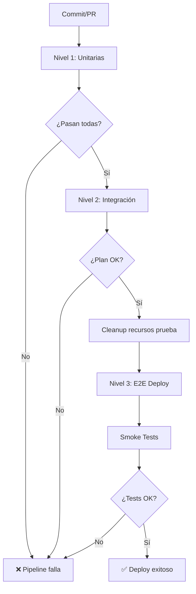

# 📊 Matriz de Pruebas IaC - Infraestructura como Código

## 🎯 Objetivo

Establecer un marco claro de pruebas multinivel que abarca desde validaciones unitarias hasta pruebas End-to-End (E2E), especificando criterios de entrada y salida para cada nivel. Esto asegura calidad, seguridad y correcto funcionamiento de la infraestructura antes de su despliegue en producción, minimizando riesgos y facilitando la automatización dentro del ciclo DevOps.

## 📐 Niveles de Prueba

### Nivel 1: Pruebas Unitarias de Módulo

**Objetivo**: Validación de la lógica y las variables de cada módulo de IaC de forma aislada.

**Criterios de entrada**:

- Código IaC modificado (commit o PR)
- Archivos Terraform (`.tf`) y Ansible (`.yml`)

**Acciones principales**:

- ✅ `terraform fmt -check -recursive` - Validar formato de código
- ✅ `terraform validate` - Validar sintaxis y configuración
- ✅ `tflint --recursive` - Linting de Terraform (mejores prácticas)
- ✅ `tfsec .` - Escaneo de seguridad (vulnerabilidades)
- ✅ `ansible-lint` - Validación de playbooks Ansible

**Criterios de salida**:

- ✅ 100% de validaciones pasadas sin errores
- ✅ Sin vulnerabilidades de seguridad detectadas
- ✅ Código conforme a mejores prácticas

**Trigger**: Ejecutar en **cada commit** o **PR** antes de merge

---

### Nivel 2: Pruebas de Integración por Stack

**Objetivo**: Despliegue de varios módulos juntos para verificar que interactúan correctamente.

**Criterios de entrada**:

- ✅ Pruebas unitarias (Nivel 1) completadas exitosamente
- Módulos individuales validados

**Acciones principales**:

- 🧪 **Terratest** - Tests de módulos con `terraform plan`
  - `network_test.go` - Validar módulo de red (VNet, Subnet, Public IP)
  - `security_test.go` - Validar módulo de seguridad (NSG, reglas)
  - `root_plan_test.go` - Validar configuración raíz integrada
- 📊 **Plan de Stack completo** - `terraform plan` del stack integrado
  - Validar outputs esperados (`vm_public_ip`, etc.)
  - Verificar dependencias entre módulos
  - Publicar plan como artefacto para revisión

**Criterios de salida**:

- ✅ Todos los tests de Terratest pasan (módulos independientes)
- ✅ Plan de Terraform generado sin errores
- ✅ Outputs del stack son los esperados
- ✅ Recursos de prueba eliminados automáticamente (cleanup job)

**Trigger**: Ejecutar **después del Nivel 1** si todas las validaciones pasan

---

### Nivel 3: Pruebas E2E por Entorno

**Objetivo**: Despliegue completo en entorno aislado y verificación del funcionamiento global.

**Criterios de entrada**:

- ✅ Plan de integración (Nivel 2) aprobado
- Artefactos del pipeline disponibles (plan, SSH keys)

**Acciones principales**:

1. **Deploy Infraestructura**

   - `terraform apply` - Desplegar stack completo en Azure
   - Capturar outputs (IP pública de VM)
   - Publicar SSH keys como artefactos

2. **Configuración de Servicios**

   - Ejecutar playbook Ansible (`setup_vm.yml`)
   - Instalar y configurar Nginx
   - Desplegar aplicación web

3. **Smoke Tests**
   - ✅ Test 1: HTTP Status 200
   - ✅ Test 2: Contenido esperado en página web
   - ✅ Test 3: Headers de Nginx presentes
   - ✅ Test 4: Tiempo de respuesta < 2s

**Criterios de salida**:

- ✅ Infraestructura desplegada sin errores
- ✅ Servicios configurados correctamente (Nginx running)
- ✅ Todos los smoke tests pasan (100% éxito)
- ✅ Aplicación accesible desde Internet

**Trigger**: Ejecutar **solo en rama main** después de aprobación manual o automática del Nivel 2

---

## 🔄 Flujo del Pipeline

## 📋 Resumen de Matriz

| Fase             | Acciones principales                             | Trigger      | Duración aprox. |
| ---------------- | ------------------------------------------------ | ------------ | --------------- |
| **Antes del PR** | Validación sintaxis, linting                     | Cada commit  | ~3-5 min        |
| **En PR**        | Ejecución plan, tests integración, security scan | PR abierto   | ~10-15 min      |
| **En main**      | Despliegue controlado, E2E, smoke tests          | Merge a main | ~20-30 min      |

## 🛡️ Buenas Prácticas Implementadas

### ✅ Datos Sensibles

- Variables secretas en GitHub Secrets (no hardcodeadas)
- SSH keys gestionadas como artefactos de pipeline
- Credenciales de Service Principal en variables secretas

### ✅ Limpieza (Cost Optimization)

- Job de cleanup automático después de Terratest
- Eliminación asíncrona de resource groups de prueba (`terratest-*`)
- Búsqueda y eliminación de recursos huérfanos

### ✅ Paralelización

- Jobs del Nivel 1 ejecutan en paralelo (TerraformLint, AnsibleLint)
- Terratest usa `t.Parallel()` en tests de módulos
- Jobs con dependencias claras para optimizar tiempo total

### ✅ Automatización

- Pipeline 100% automatizado (3 niveles)
- Generación automática de SSH keys
- Inventario Ansible dinámico
- Smoke tests automatizados con validaciones múltiples

## 📈 Métricas de Calidad

| Métrica            | Objetivo         | Estado actual         |
| ------------------ | ---------------- | --------------------- |
| Cobertura de tests | >80% de módulos  | ✅ 100% (3/3 módulos) |
| Tiempo de pipeline | <30 min total    | ✅ ~25 min            |
| Tasa de éxito      | >95% en main     | 🟡 Monitorear         |
| Vulnerabilidades   | 0 críticas/altas | ✅ 0 detectadas       |

## 🚀 Próximos Pasos

1. ✅ Implementar matriz de pruebas (completado)
2. 🔄 Agregar tests de performance (k6/Artillery)
3. 🔄 Implementar policy-as-code (OPA/Sentinel)
4. 🔄 Añadir notificaciones a Slack/Teams
5. 🔄 Dashboard de métricas de pipeline

## 📚 Referencias

- [Terraform Testing Best Practices](https://www.terraform.io/docs/cloud/guides/recommended-practices/part3.html)
- [Terratest Documentation](https://terratest.gruntwork.io/)
- [Azure DevOps Pipeline Best Practices](https://docs.microsoft.com/azure/devops/pipelines/architectures/devops-pipelines-baseline-architecture)
